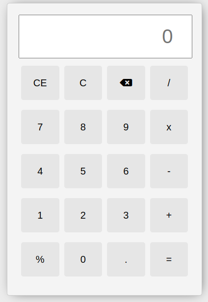

# calculator-app-js
Project to practice in JavaScript. Calculator app applying functions, methods and DOM.
 
 
URL: [Visita mi página web](https://www.example.com){:target="_blank" rel="noopener noreferrer"}

 
 

 
